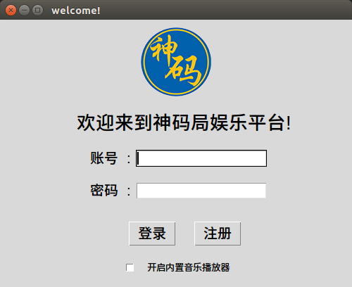
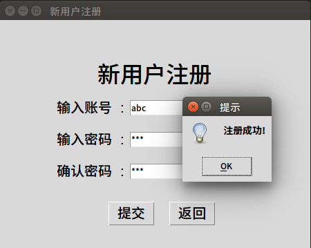
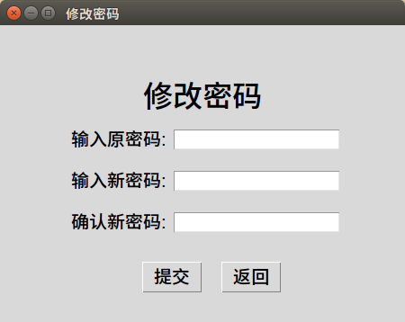
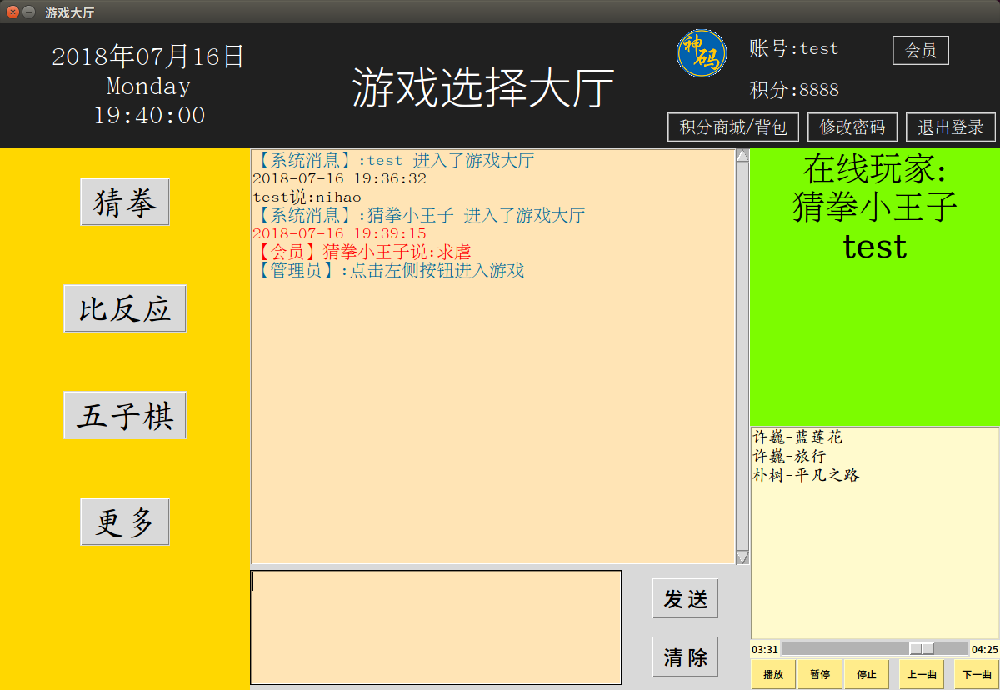
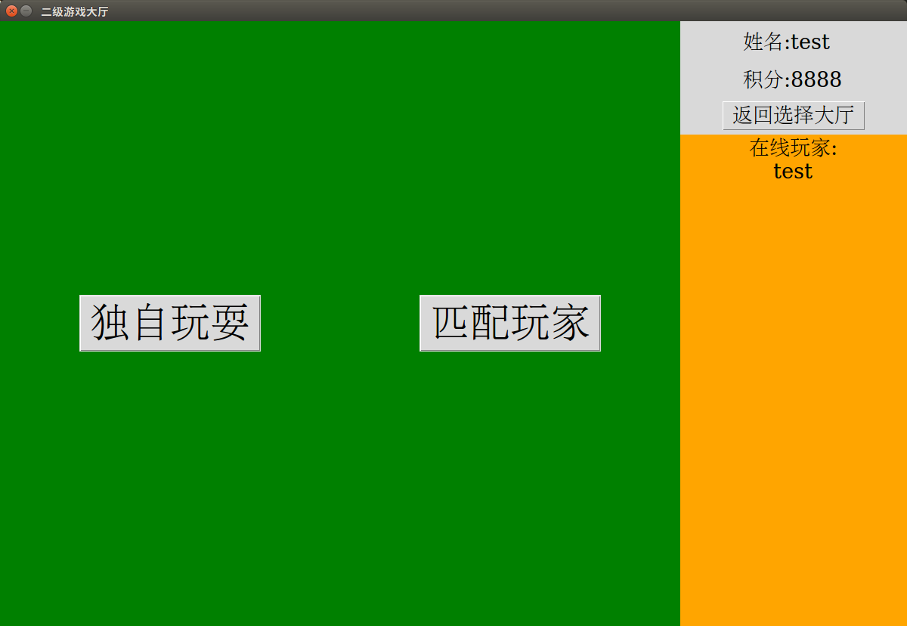
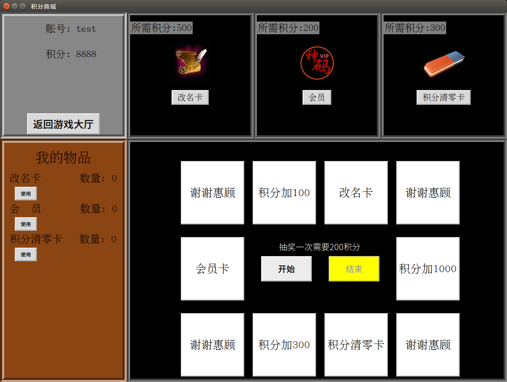
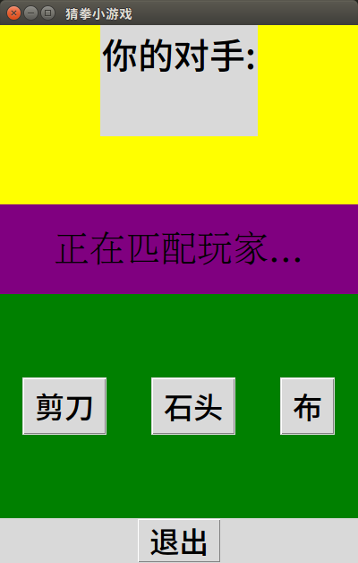
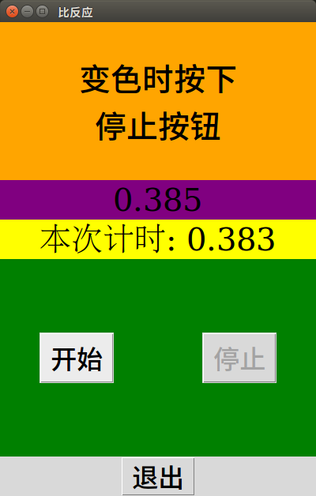
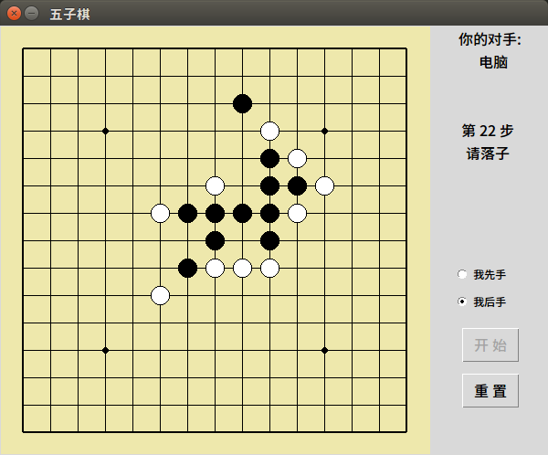

# middle_project

### middproject - django服务器
### middle_project 最终版 - 游戏客户端 + 游戏服务器
### insert.py - 数据模拟

运行截图

  <h2>客户端</h2>
  <h4>登录界面</h4>
  
  <h4>注册界面</h4>
  
  <h4>修改密码界面</h4>
  
  <h4>一级大厅界面</h4>
  
  <h4>二级大厅界面</h4>
  
  <h4>积分商城界面</h4>
  
  <h4>猜拳游戏界面</h4>
  
  <h4>比反应游戏界面</h4>
  
  <h4>五子棋游戏界面</h4>
  
  <h2>网页</h2>
  <h4>个人信息界面</h4>
  
  <h4>排行榜界面</h4>
  
  <h4>平台统计信息界面</h4>
  
  
  <h4>帮助界面</h4>
  

